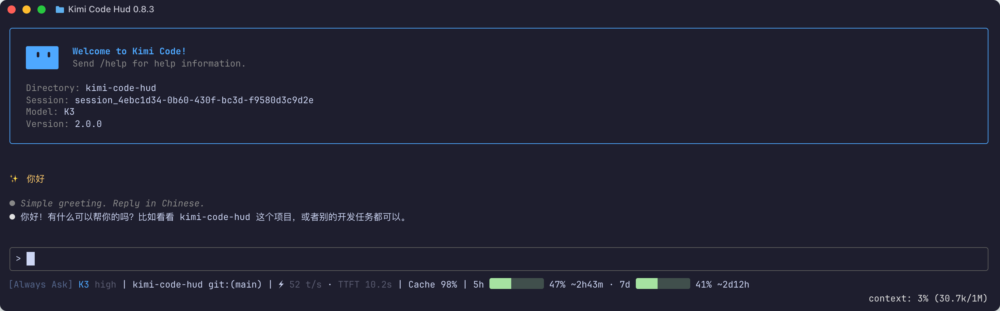
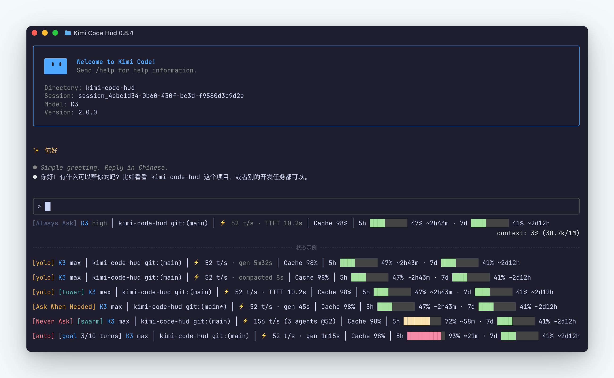

# kimi-code-hud

[](LICENSE) [](https://github.com/FinbackYu/kimi-code-hud/releases)

[English](README.en.md) · [Changelog](CHANGELOG.md) · [Issues](https://github.com/FinbackYu/kimi-code-hud/issues)



## 什么是 kimi-code-hud

自定义底部状态栏（HUD）for [Kimi Code CLI](https://www.kimi.com/) — 零依赖 Node.js 脚本，在终端 TUI 底部显示模型与思考强度、Git 分支、生成速度（TPS / TTFT）、压缩状态、会话缓存命中率与 Kimi 托管订阅额度。

## 核心特性

- **模型与思考强度** 模型名渲染为宿主主题蓝，后缀跟随 thinking 状态 / effort 强度（如 `K3 max`）；按会话固定取值，其他会话执行 `/effort` 不影响本会话显示。
- **Git 状态** 目录名 + `git:(branch*)` 脏标记，150ms 超时兜底，永不阻塞渲染。
- **生成速度** 流式 TPS 中位数 + TTFT；回合进行中换成每秒走字的 `gen Ns` 计时；多 agent 并行时聚合为舰队总速（`⚡ 156 t/s (3 agents @52)`）。
- **压缩计时** `/compact` 期间实时 `compacting Ns` 走字，完成后暗灰保留 `compacted Ns`，直到下一条 prompt 的 gen 计时接手。
- **缓存命中率** 跨回合累计的 token 加权 Cache 命中率，回合之间常亮不闪。
- **Kimi 托管订阅额度** 5h / 7d 柱条 + 百分比 + 重置倒计时，按用量绿 / 黄 / 红分级；第三方 provider 模型自动隐藏整段，不代表 API 余额或费用。
- **模式徽章** `[yolo]` / `[auto]` / `[plan]` / `[goal …]` / `[swarm]`，槽位顺序与宿主默认 footer 一致。
- **深浅双主题** 跟随宿主 `theme` 设置；light 下徽标加粗，柱条换柔和真彩色。
- **热路径安全** 每次渲染都在 300ms 内完成，所有错误静默降级——不打印日志，绝不阻塞 TUI。



## 安装

要求 Node.js ≥ 18（用到全局 `fetch`），无 npm 依赖。

**方式一：作为 Kimi Code 插件安装（推荐，方便开关）**

在 Kimi Code TUI 中运行：

```
/plugins install https://github.com/FinbackYu/kimi-code-hud
```

- 安装后**重启或开新会话**生效：插件声明的 `SessionStart` hook 会把 `tui.toml` 的 `[status_line]` 指向插件托管副本（`~/.kimi-code/plugins/managed/kimi-code-hud/`），并在每次会话启动时自动修复该条目；
- 开关：在 `/plugins` 面板选中后按 `Space`，或运行 `/plugins disable kimi-code-hud` / `/plugins enable kimi-code-hud`。禁用或移除后约 1 秒内，托管副本会自动从 `tui.toml` 清除自己的 `[status_line]` 条目并停止渲染（宿主会缓存最后一帧自定义状态栏，需 `/reload-tui` 或新会话才回退为内置布局）；重新启用后，下个会话的 SessionStart hook 会自动把条目写回；
- 如果你已经在 `[status_line]` 配置了自己的其他命令，hook 不会覆盖它。

**方式二：手动安装（git checkout）**

```bash
git clone https://github.com/FinbackYu/kimi-code-hud ~/kimi-code-hud
node ~/kimi-code-hud/bin/kimi-hud.mjs --install
```

`--install` 会先备份 `~/.kimi-code/tui.toml` 为 `tui.toml.<时间戳>.bak`，再在 `[status_line]` 段写入 `command = "node <绝对路径>"`（幂等，已有 `items` 会保留）。同时向 `~/.kimi-code/config.toml` 追加一段受管 `SessionStart` hook（START/END 注释包裹，不碰其他 hooks 和设置）：宿主某些升级会重写 `tui.toml`、抹掉 `[status_line]`（0.30.0→0.31.0 实测发生），而 `config.toml` 的 hooks 在升级中保留，于是每次会话启动时 hook 都会自检并把条目修回。**重启 Kimi Code 或运行 `/reload-tui` 生效。**

> 两种方式不要混用：插件启用期间，hook 会把 `tui.toml` 指向托管副本。想回到手动安装，先 `/plugins remove kimi-code-hud`，再重新 `--install`。

## 更新

- **重装即更新**：再跑一遍 `/plugins install https://github.com/FinbackYu/kimi-code-hud`。托管副本原地替换，状态栏约 1 秒内自动用上新版本，无需 `/reload-tui` 或新会话。
- 版本变化见 [CHANGELOG.md](CHANGELOG.md)；稳定版本在 GitHub Releases 发布。

## 临时关闭 / 开启

调试时想临时退回内置状态栏，不必 `--uninstall`（那会一并摘掉自愈 hook）：

```bash
node ~/kimi-code-hud/bin/kimi-hud.mjs --off
node ~/kimi-code-hud/bin/kimi-hud.mjs --on
```

- `--off`：向 `~/.kimi-code-hud/config.json` 写入 `"disabled": true`（保留 `layout` 等其他键），备份后移除 `tui.toml` 的 `[status_line]` 命令；`config.toml` 的自愈 hook 块不动——hook 见到该旗标会保持沉默，不会在下次会话启动时把 HUD 复活；
- `--on`：删除 `disabled` 键，把命令写回 `tui.toml` 并确保 hook 块在位。

**重启 Kimi Code 或运行 `/reload-tui` 生效。**

## 卸载

插件方式安装：`/plugins remove kimi-code-hud`（按官方行为托管副本仍留在磁盘上、安装记录被删除；托管副本下次运行时自动清除 `tui.toml` 里的条目，`/reload-tui` 或新会话后回退内置布局）。

手动方式安装：

```bash
node ~/kimi-code-hud/bin/kimi-hud.mjs --uninstall
```

同样先备份，然后移除 `[status_line]` 中本工具的 `command` 行，并一并移除 `config.toml` 里的自检 hook 块。

## 配置

- `~/.kimi-code-hud/config.json`：`{"layout":"compact"|"normal"}`（默认 `normal`）；`"disabled": true` 是 `--off` 写入的开关旗标（缺省即启用，`--on` 删除该键）
- 环境变量 `KIMI_HUD_LAYOUT` 优先于配置文件
- `NO_COLOR` 或 `KIMI_HUD_NO_COLOR`：禁用全部 ANSI 颜色
- `KIMI_HUD_THEME=dark|light`：手动固定配色主题。缺省跟随 `tui.toml` 顶层的 `theme` 设置；`"auto"` 经 `COLORFGBG` 判定、回退 dark（状态行无法在 300ms 热路径上执行宿主的 OSC 11 查询）；自定义主题名回退 dark。light 下徽标（模型名、`[plan]`、`[yolo]`、`[swarm]`、`[auto]`）加粗显示，琥珀/青色比宿主默认更亮（`#D97706`/`#14B8A6`），额度柱体从刺眼的 ANSI 红改为柔和真彩色（`#B91C1C`/`#D97706`/`#0E7A38`）；dark 模式不变，柱体 ANSI 色由终端按自身主题重映射

两档布局：

```
compact: [manual] K3 high │ git:(main*) │ ⚡ 47 │ Cache 92% │ 5h 31% ~2h18m
normal:  [manual] K3 high │ kimi-code-hud git:(main*) │ ⚡ 47 t/s · TTFT 1.3s │ Cache 92% │ 5h ███░░░░░░░ 31% ~2h18m · 7d ██░░░░░░░░ 25% ~3d2h
```

/goal 模式下，模式徽章与模型之间插入 goal 徽章（两档都显示，与宿主默认 footer 的槽位顺序一致）：

```
[manual] [goal ● active · 4m · 7 turns] K3 high │ …
```

- 模型名以宿主主蓝色（dark 主题 `#4FA8FF` / light 主题 `#1565C0`，即对话中链接/行内代码的蓝，随主题切换）显示；模型后缀显示 thinking 状态：布尔模型为 ` thinking`，支持 effort 的模型直接显示强度（如 `K3 high`，compact 档同样只保留 ` <effort>`）（status line payload 不含此字段；优先取会话日志 `config.update` 事件——新版宿主键为 `thinkingEffort`，会话启动即有初始记录；旧版为 `thinkingLevel`，只在会话内切换过 effort 时记录。两者都没有时按会话快照固定取值，快照存 `~/.kimi-code-hud/thinking-<sessionId>.json`；快照不存在时才回退解析 `~/.kimi-code/config.toml` 的 `[thinking]` 与模型表并写入快照——这样其他会话执行 `/effort` 改写全局配置后，本会话显示不会跟着变）；
- goal 徽章：格式与宿主默认 footer 一致（`[goal ● <status> · <计时> · <轮数>]`；设了 turn 预算显示 `3/10 turns`；圆点 active 蓝 / blocked 琥珀 / paused 暗灰）。status line payload 不含 goal 字段，状态从会话日志 `wire.jsonl` 的 `goal.create`/`goal.update`/`goal.clear`/`forked` op 重建（与 TPS 同一次增量扫描）；active 时按 `wallClockResumedAt` 每秒走动计时，goal 完成或清除后徽章消失。徽章显示期间速度段只留吞吐——`gen` 计时、TTFT 与压缩状态一并隐藏（徽章已自带会话计时，与回合内自动压缩不展示同一逻辑：该时段已被任务计时覆盖）；
- TPS 只接纳流式阶段至少 250ms、且不超过 1000 t/s 的 `step.end` 样本；积累 3 个有效样本后开始显示，取最近最多 5 个样本的中位数。窗口过期（最后一个样本超过 2 分钟）后不隐藏：最后一次中位数以暗灰继续显示，直到新窗口预热完成；模型切换时旧中位数一并清除、重新预热。首次预热（还没有中位数）期间仍显示最近一次 TTFT；
- Cache 为本次会话的 token 加权缓存命中率：`Σ inputCacheRead / Σ (inputOther + inputCacheRead + inputCacheCreation)`，跨回合累计主 Agent 的全部模型请求（usage 字段不完整的 step 跳过不计）。数值本身即跨回合累计的最新值，回合之间常亮不闪烁；会话尚无数据时整段省略。各档只显示百分比；不使用红黄绿阈值；
- 配额段：normal 档为柱+百分比+重置倒计时；compact 档去掉柱体，保留百分比和倒计时；周配额（7d）只在 normal 档显示。仅当当前模型由 Kimi Code 托管订阅（`managed:kimi-code`）提供时显示——经 `/provider` 接入、用 `/model` 切到的第三方 provider 模型整段隐藏（配额接口只描述托管订阅，与当前会话实际用量无关）；`/logout` 删除凭证后配额缓存一并清除；
- 行首徽章与权限模式对齐：`[yolo]`（琥珀黄，对齐宿主默认）/`[auto]`（亮红，便于区分）/`[manual]`（暗灰占位，保持行首对齐），plan 模式加 `[plan]`（蓝色）；`[swarm]`（青色）取自会话 wire 日志的 `swarm_mode.enter/exit` 事件（与 goal 徽章同一推导路径——status line payload 不含 swarm 状态），宿主以后若在 payload 携带 `swarmMode` 字段同样生效；
- 用量分级着色：<60% 绿、<85% 黄、≥85% 红；normal 档作用于柱条，compact 档没有柱体、由百分比数字接替（绿档不醒目化处理、保持默认色，只有黄 / 红上色）；
- 输出超过 200 字符自动降级 normal→compact。

## 原理

Kimi Code 的 `~/.kimi-code/tui.toml` 支持 `[status_line]` 自定义命令：

- 每次刷新（每秒最多一次）宿主通过 stdin 传入一个 JSON 快照（model、cwd、gitBranch、permissionMode、planMode、contextTokens 等字段；读取上限 1 MiB、150ms 超时，超限按无快照静默回退）；
- 命令 stdout 的**第一行**接管底部 Footer 第一行（第二行固定由宿主绘制 `context: N%`，插件无法接管）；
- 命令须在 **300ms** 内完成；首次尚无成功输出时，失败/超时/空输出会让宿主渲染内置第一行，已有成功帧后则继续重播上一帧——所以本脚本对所有错误静默降级、绝不打印日志；唯一的非零退出是有意为之：当脚本是"已禁用/已移除插件的托管副本"时，它会先自我清除 `tui.toml` 里的条目再非零退出（宿主在条目仍存在时会一直重播最后一帧，仅非零退出不足以交还状态栏），`/reload-tui` 或新会话后回退内置布局（插件开关即由此实现）。

三段数据来源：

| 段 | 来源 |
|---|---|
| 模型 / 分支 | stdin 快照 + `git status --porcelain`（150ms 超时） |
| TPS / TTFT / Cache / thinking / goal / swarm | 增量解析会话目录下**所有** `~/.kimi-code/sessions/*/session_<id>/agents/*/wire.jsonl`（main + 全部 subagent；旧版 `ses_<id>` 前缀兼容）的 `turn.prompt`、`step.end`、`llm.request`、`turn.cancel`、`config.update`、`goal.*`、`swarm_mode.*` 与 `full_compaction.*` 事件。速度样本带事件时间戳并按 agent 分桶，只取最近 10 分钟内的最多 5 个做中位数——resume 接续、长时间空闲、compact 之后不会混入陈旧样本。多个 agent 同时活跃（swarm/subagent，2 分钟内有样本或有请求在飞；子 agent 回合随收尾 `end_turn` 结束立即退出统计，不会拖到 2 分钟窗口过期）时显示**舰队总速度 + agent 数 + 平均速度**（`⚡ 305 t/s (12 agents @25)`：305 是各活跃 agent 中位速度的合计，`@25` 是其均值），TTFT 取活跃 agent 的中位数（单个卡住的 agent 不会污染显示）。回合进行中（从 `turn.prompt` 到 `end_turn`/`turn.cancel`）速度段把 TTFT 换成每秒走字的 `gen Ns` 工作计时——跨工具调用与多个 step 累计，回答「这条命令一共跑了多久」（goal 徽章显示期间该计时、TTFT 与压缩状态一并隐藏，只留速度）。回合之外的上下文压缩（手动 `/compact`，从 `full_compaction.begin` 到 `complete`/`cancel`）同样占 TTFT 槽位：实时 `compacting Ns` 走字，完成后暗灰保留 `compacted Ns` 直到下一条 prompt 的 `gen` 计时接手；回合内触发的自动压缩不显示（该时段由 `gen` 计时覆盖）。Cache、thinking、goal、swarm 只取主 agent wire（per-agent byte offset 与会话累计 Cache 计数存 `~/.kimi-code-hud/metrics-<sessionId>.json`，每秒只读新增字节；旧状态仅做一次最多 1 MiB 的 Cache 回填） |
| 配额（5h/7d） | `GET https://api.kimi.com/coding/v1/usages`，60 秒 TTL 缓存于 `~/.kimi-code-hud/quota.json`，过期时热路径用过期缓存渲染并 spawn 后台刷新，绝不阻塞。仅当前模型属 `managed:kimi-code`（按会话日志的 `modelAlias` → `config.toml` 模型表的 `provider` 键判定，判不出来时保持显示）时渲染与刷新；凭证缺失（`/logout`）时缓存一并删除；access_token 过期但 refresh_token 仍在（CLI 懒刷新，空闲期常见）时 401 不再清缓存，保留旧值直至刷新成功 |

## 隐私与安全

access token 仅从 `~/.kimi-code/credentials/kimi-code.json` **本地读取**（Kimi Code CLI 自己负责续期，本工具只读不写），仅用于请求官方 `api.kimi.com` 配额接口，不写入任何日志、缓存或输出。

## FAQ

**状态栏没变化？** 确认 `/reload-tui` 或重启过；确认 `node <path>` 直接 `echo '{}' | node bin/kimi-hud.mjs` 有输出。

**没有 TPS？** 只有两种状态会完全看不到 TPS：首次预热（还没攒够 3 个有效 `step.end` 样本，期间先单独显示 TTFT）和刚切换模型（旧中位数随之清除、重新预热）。窗口过期不再隐藏，改以暗灰显示最后一次中位数。若连 TTFT 也没有，说明当前会话还没有完成过 `step.end`。

**没有 Cache？** 会话还没有任何完整 `step.end` 用量时整段省略；首个有效用量计入后出现，此后常亮不再消失。升级后旧状态会从 wire 尾巴（最多 1 MiB）一次性重建累计计数。

**没有配额段？** 先确认当前模型不是第三方 provider（`/provider` 接入的模型本就不显示配额，接口只覆盖托管订阅）。managed 模型下，缓存首次生成前整段省略（不显示"加载中"）。可手动 `node bin/kimi-hud.mjs --refresh-quota` 后重试；该命令静默执行，检查 `~/.kimi-code-hud/quota.json` 是否生成。

**Context 段去哪了？** 插件不再自绘 Context 段（full 档已一并移除），直接看宿主第二行的 `context: N% (tokens/max)`（该行永远由宿主绘制，插件无法接管）。

## 能力与已知问题

- [能力清单](CAPABILITIES.md)：Kimi Code 0.31.0 七个第一行 slots 的覆盖情况、数据来源，以及已经可读但尚未展示的 Cache/token/goal/task/Git 等信息；
- [已知问题](KNOWN_ISSUES.md)：后台任务、Git、终端宽度与失败帧等待处理问题及验收条件。

## 本地开发

```bash
npm test        # node --test
```

## 许可证

基于 [MIT](LICENSE) 协议发布。© 2026 FinbackYu
